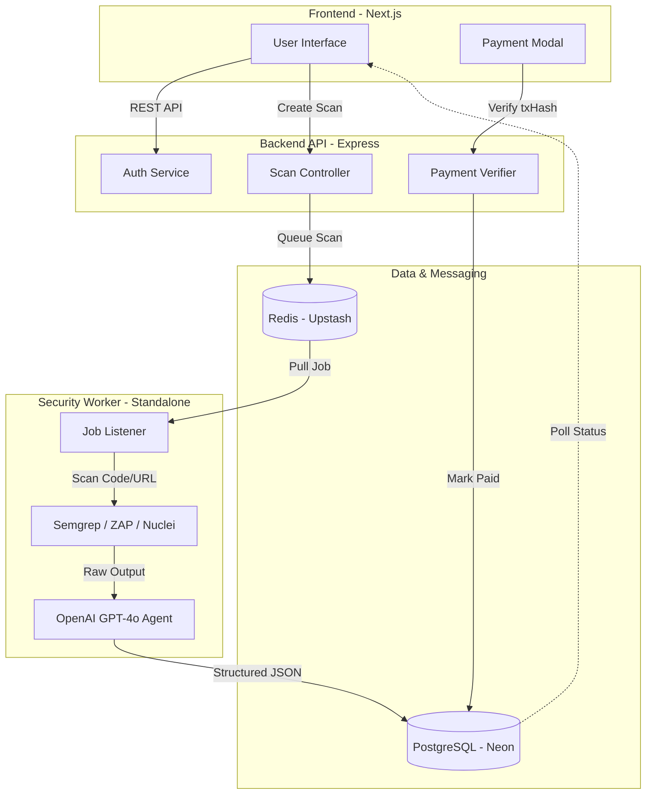

# 🛡️ Pay-As-You-Go AI Hacker

**Pay-As-You-Go AI Hacker** is a next-generation security-as-a-service platform that provides instant, AI-driven vulnerability assessments for websites and GitHub repositories. Leveraging the **Stellar blockchain** for micro-payments, it offers a truly democratic and scalable approach to cybersecurity.

---

## 🏗️ System Architecture

The platform uses a distributed, event-driven architecture to handle intensive security scans without compromising performance.



---

## 🚀 Core Functions

### 1. 🔐 Decentralized Payments (Stellar x402)
Users pay for individual scans using the Stellar network. 
- **Micro-payments**: Each scan costs ₹5.00 (approx. 0.15 XLM).
- **Instant Access**: The system verifies the transaction hash on-chain and unlocks the scan immediately.

### 2. 🔍 Automated Security Intelligence
The platform integrates industry-standard security tools:
- **Web App Scanning**: Uses OWASP ZAP and Nuclei for dynamic analysis (DAST).
- **Code Analysis**: Uses Semgrep for static application security testing (SAST) on GitHub repositories.

### 3. 🤖 AI-Powered Remediation
Instead of overwhelming users with raw tool logs, our **AI Agent** (GPT-4o):
- Parses complex tool outputs.
- Categorizes vulnerabilities by severity (Critical, High, Medium, Low).
- Generates **Actionable Fixes** including code snippets and remediation steps.

---

## 🔄 How the System Works

1.  **Initiation**: A user provides a target (URL or GitHub owner/repo).
2.  **Payment**: The system generates a unique Stellar memo. The user sends payment via their wallet.
3.  **Queuing**: Once verified, the API server pushes a job into the **BullMQ** scan-queue (Redis).
4.  **Execution**: The **Standalone Worker** picks up the job, clones the code or crawls the site, and executes the security probes.
5.  **Refinement**: Raw tool data is sent to the AI service, which structures the findings into a human-readable format.
6.  **Reporting**: The user is notified on their dashboard, where they can view findings, export them as a report, or trigger automated PR fixes.

---

## 🛠️ Tech Stack

- **Frontend**: Next.js 15, TypeScript, Tailwind CSS, Shadcn UI.
- **Backend API**: Node.js, Express, Prisma ORM.
- **Background Processing**: BullMQ (Node.js), Redis.
- **Database**: PostgreSQL (Neon.tech).
- **Security Tools**: Semgrep, OWASP ZAP, Nuclei.
- **Cloud/AI**: OpenAI GPT-4o API, Upstash (Redis).

---

## 📦 Installation & Setup

### Prerequisites
- Node.js v18+
- PostgreSQL (or Neon DB account)
- Redis (or Upstash account)
- OpenAI API Key

### Running Locally
1. **Clone the Repo**:
   ```bash
   git clone https://github.com/your-username/ai-hacker.git
   ```
2. **Setup Server**:
   ```bash
   cd server && npm install && npm run dev
   ```
3. **Setup Worker**:
   ```bash
   cd worker && npm install && npm run dev
   ```
4. **Setup Client**:
   ```bash
   cd client && npm install && npm run dev
   ```

---

## 📄 License
MIT License. Created for the **Stellar x AI Hackathon 2026**.
